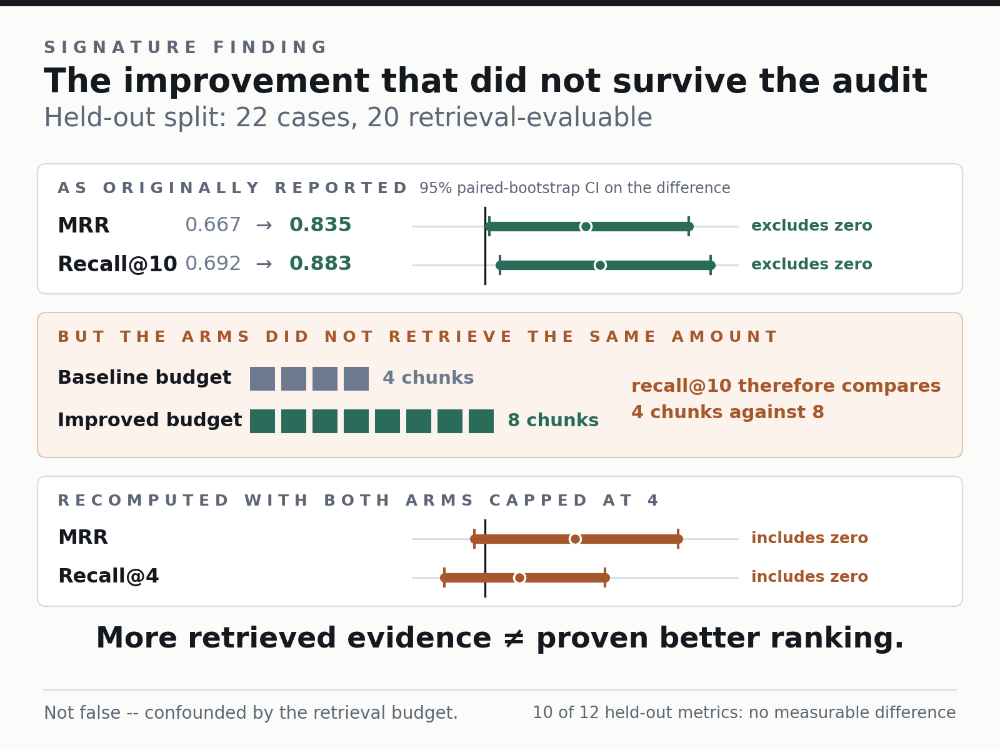
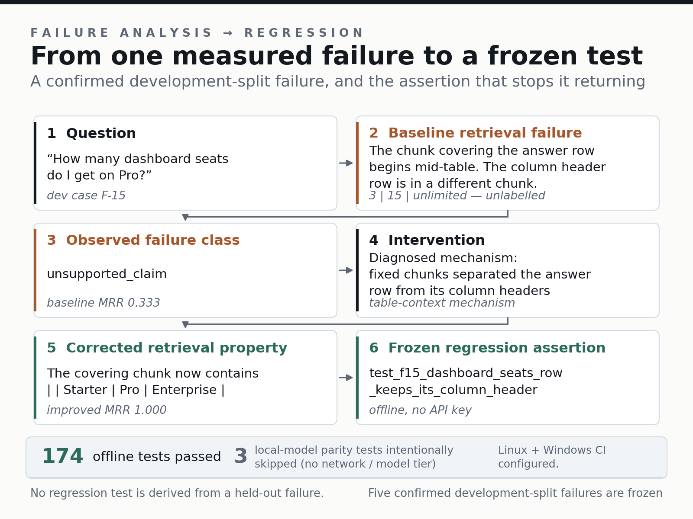

# RAG Evaluation Lab

[](https://github.com/Jupiter-Plantagenet/rag-evaluation-lab/actions/workflows/ci.yml)

RAG Evaluation Lab is a reproducible evaluation and regression-testing harness
for document-grounded AI systems. It measures retrieval, citation resolution,
abstention and failure behaviour, compares interventions case by case, and turns
confirmed development failures into regression tests.

It answers questions a chatbot demo cannot: whether the right evidence was
retrieved, citations resolve against the context shown to the model, and a change
improves reliability rather than merely increasing retrieval opportunity.

## Signature finding



The improved configuration initially appeared stronger on held-out retrieval,
but it retrieved twice as many chunks (8 versus 4). A post-hoc common-budget
sensitivity analysis did not establish better held-out ranking. The harness
prevented additional context budget from being presented as proven ranking
improvement.

## What the harness demonstrates

- Evidence-anchored evaluation cases with quote-derived spans.
- Span-level retrieval, ranking and document-coverage measurement.
- Structured per-case traces: retrieval, shown context, citations, answer and errors.
- Citation resolution against the context map actually supplied to the model.
- Ambiguity and abstention behaviour checks.
- Cause-ordered failure classification and frozen regression tests.
- Paired before/after reports from stored traces, without model calls.

## Failure → regression



Development case F-15 exposed a fixed-size chunk boundary splitting a table row
from its column headers. The diagnosed mechanism was incomplete table context;
the observed failure class was an unsupported claim. Structure-aware chunking
keeps that header with the row, and an offline regression assertion preserves the
property.

## Experiment in brief

This controlled single-author case study uses a distributable synthetic NovaPay
corpus (14 documents) and 50 cases: 28 development and 22 held-out. It compares
a baseline configuration with an improved retrieval configuration. Synthetic
evidence makes ground truth inspectable and reproducible; it does not establish
external validity for production corpora.

## Results

Corrected-v2 reports are derived from immutable frozen traces. nDCG is deprecated
from current conclusions because neither its original nor bounded replacement
definition fits every evidence/chunk arrangement. The historical document-level
citation-authority flag is also excluded from current reporting.

Configured-system outcomes compare the complete pipelines at their actual budgets
(baseline k=4; improved k=8): span recall was 0.692 → 0.883 and MRR 0.667 →
0.835. Precision was 0.287 at baseline k=4 versus 0.150 at improved k=8.

The post-hoc common-budget sensitivity holds both arms to k=4: MRR was 0.667 →
0.817 (delta +0.150, 95% paired-bootstrap CI [-0.017, +0.321]); span recall was
0.692 → 0.750 (delta +0.058, CI [-0.067, +0.200]). These results do not establish
a held-out ranking advantage at a common candidate budget.

See the [corrected held-out report](reports/corrected-v2/held-out/comparison.md)
and [correction record](docs/corrected-release-v2.md) for source hashes and tables.

## Run / verify

No API key is needed to validate or re-score stored evidence.

```bash
git clone https://github.com/Jupiter-Plantagenet/rag-evaluation-lab.git
cd rag-evaluation-lab
python -m venv .venv
# Windows: .venv\Scripts\activate
# Linux:   source .venv/bin/activate
pip install -r requirements/lock/windows-py312.txt  # use linux-py312.txt on Linux
pip install -e . --no-deps
python scripts/verify_frozen.py
python scripts/validate_corpus.py
python scripts/validate_dataset.py
python scripts/derive_corrected_v2.py
python -m pytest tests/unit tests/integration tests/regression -q
```

Provider execution is optional. The documented experimental run path requires
explicit held-out authorization and logs accesses.

## Engineering evidence

- Unit, integration and regression suites.
- Linux and Windows CI configured.
- Ruff formatting/linting and mypy checks.
- Corpus/dataset validation and frozen-artifact checksum verification.

## Scope

- Controlled synthetic corpus and bounded same-domain case study.
- Citation metrics establish resolution, not semantic entailment.
- One model/corpus configuration; findings are not production-serving evidence.
- Common-budget results are a post-hoc sensitivity analysis.

## Evidence and documentation

[Corrected results](reports/corrected-v2/held-out/comparison.md) ·
[methodology](docs/evaluation-methodology.md) ·
[architecture](docs/architecture.md) ·
[frozen evidence](docs/frozen-held-out-result.md) ·
[statistical audit](docs/statistical-audit.md) ·
[regression tests](tests/regression/test_frozen_dev_failures.py) ·
[reproduction](docs/reproduction.md) ·
[limitations](docs/limitations.md) ·
[case study](portfolio/case-study.md) ·
[deferred work](docs/deferred-work.md)
